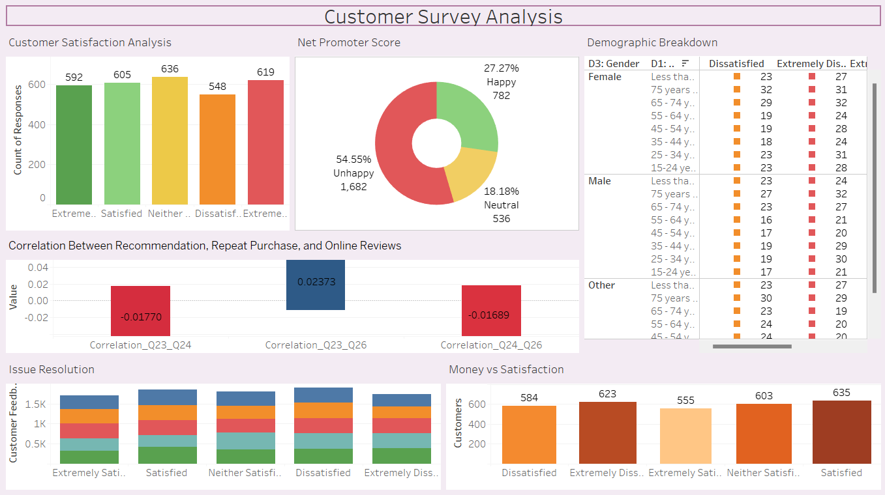

 
 

    
   
  A Data Visualization Project

## 📊 Tableau Dashboard for Customer Survey Data

This project presents an interactive **Tableau Dashboard** for analyzing customer survey responses. It provides insights into customer satisfaction, net promoter scores, correlations, demographic breakdowns, issue resolution, and monetary impact on satisfaction.

---

## 📌 Features

- **Customer Satisfaction Analysis**: Displays customer satisfaction levels with bar charts.
- **Net Promoter Score (NPS)**: Pie chart visualization of happy, neutral, and unhappy customers.
- **Correlation Analysis**: Examines relationships between recommendations, repeat purchases, and online reviews.
- **Demographic Breakdown**: Analyzes satisfaction levels across different age and gender groups.
- **Issue Resolution**: Evaluates customer feedback on issue handling.
- **Monetary Impact on Satisfaction**: Assesses the connection between money spent and satisfaction.

---

## 📂 Files Included

- `image.png` - Snapshot of the Tableau dashboard.
- `Customer Data Report.pdf` - Detailed documentation of the customer survey dataset.
- `dummy_data.xlsx` - Sample dataset used for visualization in Tableau.

---

## 🛠️ Technologies Used

- **Tableau** - For data visualization and dashboard creation.
- **Python (Optional)** - Used for preprocessing survey data before importing into Tableau.
- **Excel/CSV** - Data source for customer survey responses.

---

## 🚀 How to Use

1. Open the `Customer Data Report.pdf` to understand the dataset.
2. Import the survey data into Tableau.
3. Use the provided dashboard structure to analyze customer trends and insights.
4. Modify and enhance the dashboard based on additional data or business requirements.

---

## 📷 Dashboard Preview

---

## 📬 Contact

For questions or improvements, feel free to reach out or contribute to the project!
